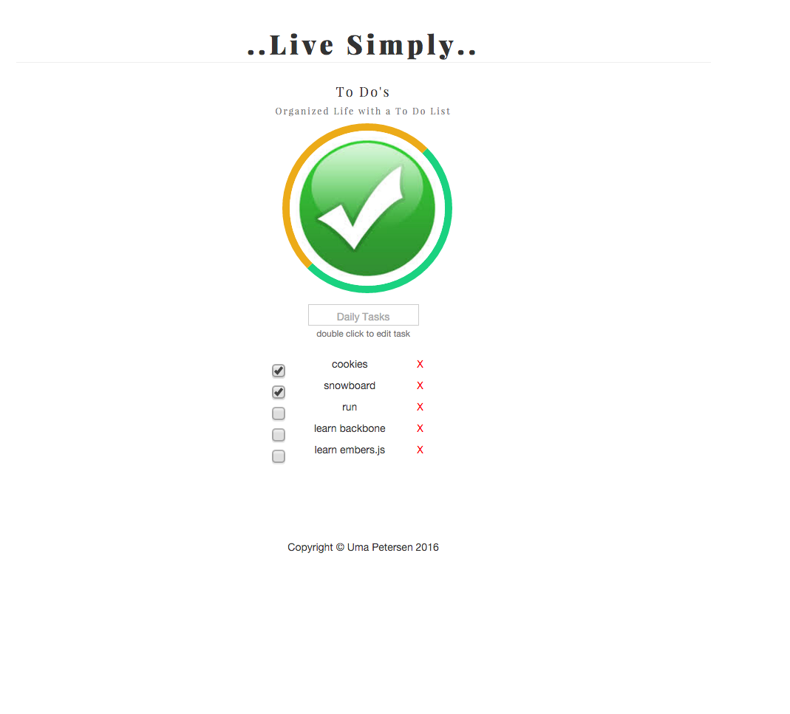

<h1> TO DO List In Backbone.js and Local Storage</h1> 

 This is a simple application using Backbone.js to create a simple To Do List for client side. The goal was to create a to do list application using CRUD to create, rewrite, update, delete methods by using Local Storage 
<h6>Extra:</h6>

Index2.html is a to do list using plain vanilla JavaScript and local storage.

	

<h1>Requiremnets:</h1>
files structure:

<ul>
  <li>TODOList/</li>
  <li>css/
    <ul>
      <li>app.css</li>
    </ul>
    <li>js/
    <ul>
      <li>app.js</li>
    </ul>
  </li>
  <li>index.html</li>
  <li>index2.html</li>
  <li>readme.md</li>

</ul>

<h1>Tech Stack</h1>
<li>Backbone.js</li> 
<li>CSS3</li>
<li>JavaScript</li> 
<li>HTML5</li>
<li>Bootstrap</li> 

fork it! play around

<h1>Preview:</h1>

